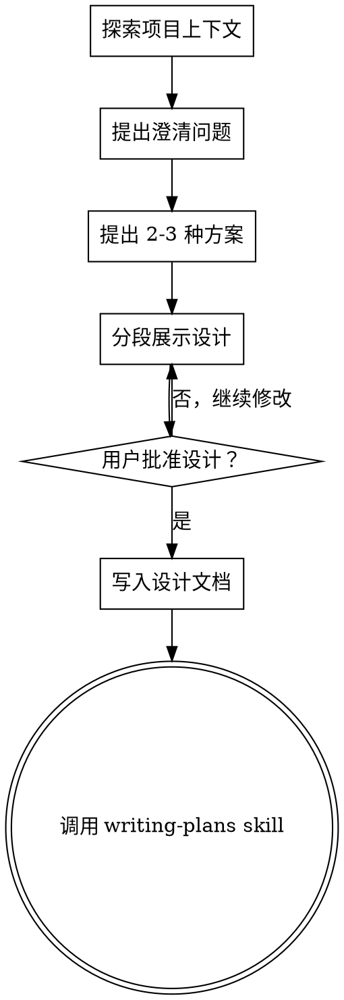

# 将想法转化为设计

## 概述

通过自然、协作式对话，把一个想法逐步打磨成完整的设计与规格说明。

首先了解当前项目背景，然后一次只提出一个问题来澄清需求。当你真正理解了要构建什么之后，再展示设计方案并获得用户批准。

<HARD-GATE>
在你展示设计并获得用户批准之前，不得调用任何实现类 skill、不得编写任何代码、不得构建项目，也不得采取任何实现动作。无论项目看起来多简单，都必须遵守。
</HARD-GATE>

## 反模式："这很简单，不需要设计"

每个项目都必须经过这个过程。待办列表、单功能工具、小型配置变更——这些“看起来简单”的项目，恰恰最容易因为未经验证的假设而返工。设计可以很短（真正简单的项目可能只需几句话），但你必须展示它，并获得批准。

## 检查清单

你必须为每个项目按顺序完成以下任务：

1. **探索项目上下文** —— 检查代码文件、文档、最近的提交记录
2. **提出澄清问题** —— 一次一个，弄清目标、限制与成功标准
3. **提出 2-3 种可选方案** —— 说明利弊并给出推荐
4. **展示当前设计** —— 按复杂度拆分讲解，并在每个部分后获得用户确认
5. **编写设计文档** —— 保存到 `docs/plans/YYYY-MM-DD-<topic>-design.md` 并提交到 Git
6. **过渡到实施计划** —— 调用 `writing-plans` skill 创建实施计划

## 流程图



**最终状态必须是调用 `writing-plans`。** 头脑风暴结束后，不要调用前端设计、mcp-builder 或其他实现类 skill。下一步唯一允许调用的 skill 是 `writing-plans`。

## 过程

**理解想法：**
- 先检查当前项目状态（代码文件、文档、最近提交）
- 一次只提出一个问题来澄清需求
- 尽量使用多选题；必要时再用开放式问题
- 每条消息只问一个问题；如果一个主题需要继续深挖，就拆成多轮
- 聚焦于：目标、约束、成功标准

**探索方案：**
- 提出 2-3 种有明显权衡差异的方案
- 用对话形式给出选项、你的推荐和推荐理由
- 先说推荐方案，再解释为什么推荐它

**展示设计：**
- 当你确信自己理解了要构建什么后，再展示设计
- 按复杂度控制篇幅：简单设计几句话即可，复杂设计每段不超过 200-300 字
- 每展示完一个部分，都询问用户当前内容是否正确
- 至少覆盖：架构、组件、数据流、异常处理、测试策略
- 发现有不合理之处时，主动回到澄清阶段

## 设计产物

**文件输出：**
- 将经确认的设计写入 `docs/plans/YYYY-MM-DD-<topic>-design.md`
- 设计文档正文应优先使用中文，保持结构清晰、简洁、可执行
- 建议设计文档使用以下中文结构：

```markdown
# [功能名称] 设计说明

## 背景与目标
[说明要解决的问题、目标和成功标准]

## 现状与约束
[现有实现、依赖条件、限制项]

## 方案对比
### 方案一：[名称]
- 优点：
- 缺点：

### 方案二：[名称]
- 优点：
- 缺点：

## 推荐方案
[说明推荐理由]

## 详细设计
### 架构
### 关键组件
### 数据流 / 接口
### 异常与边界处理
### 测试策略

## 风险与待确认项
```

- 如有可能，将设计文档提交到 Git

**实施衔接：**
- 调用 `writing-plans` skill 创建详细实施计划
- 不要调用其他 skill；下一步只能是 `writing-plans`

## 关键原则

- **一次一个问题** —— 不要同时抛出多个问题
- **优先多选题** —— 通常比开放式问题更容易回答
- **YAGNI 要彻底** —— 从设计中删掉非必要内容
- **总是探索备选方案** —— 在收敛前先提出 2-3 种可行方案
- **增量确认** —— 展示一部分，确认一部分
- **保持灵活** —— 发现理解偏差时及时回退澄清
