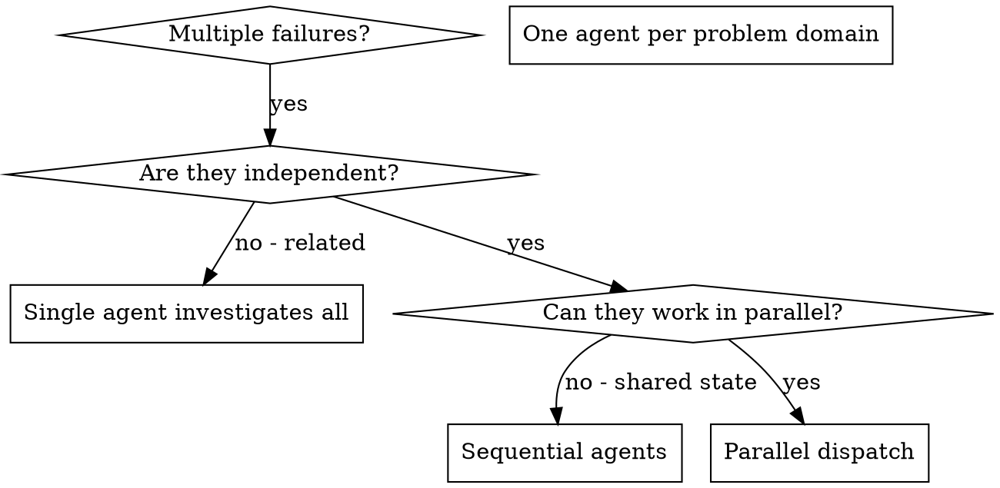

# 调度并行代理

## 概述

当您遇到多个不相关的故障（不同的测试文件、不同的子系统、不同的错误）时，按顺序调查它们会浪费时间。每项调查都是独立的，可以并行进行。

**核心原则：** 每个独立问题域调度一名代理。让他们同时工作。

## 何时使用



**使用时间：**
- 3 个以上的测试文件因不同的根本原因而失败
- 多个子系统独立损坏
- 每个问题都可以在没有其他问题的上下文的情况下被理解
- 调查之间没有共享状态

**请勿在以下情况下使用：**
- 故障是相关的（修复一个可能会修复其他故障）
- 需要了解完整的系统状态
- 代理会互相干扰

## 模式

### 1. 识别独立域

按损坏的情况对失败进行分组：
- 文件 A 测试：工具审批流程
- 文件 B 测试：批量完成行为
- 文件 C 测试：中止功能

每个域都是独立的 - 修复工具批准不会影响中止测试。

### 2. 创建有针对性的代理任务

每个代理获得：
- **具体范围：** 一个测试文件或子系统
- **明确的目标：** 通过这些测试
- **约束：** 不要更改其他代码
- **预期输出：** 您发现并修复的内容的摘要

### 3. 并行调度

```typescript
// In Claude Code / AI environment
Task("Fix agent-tool-abort.test.ts failures")
Task("Fix batch-completion-behavior.test.ts failures")
Task("Fix tool-approval-race-conditions.test.ts failures")
// All three run concurrently
```

### 4. 审查和整合

当代理返回时：
- 阅读每个摘要
- 验证修复不冲突
- 运行完整的测试套件
- 整合所有变更

## 代理提示结构

好的代理提示是：
1. **专注** - 一个明确的问题领域
2. **独立** - 理解问题所需的所有上下文
3. **具体输出** - 代理应该返回什么？

```markdown
Fix the 3 failing tests in src/agents/agent-tool-abort.test.ts:

1. "should abort tool with partial output capture" - expects 'interrupted at' in message
2. "should handle mixed completed and aborted tools" - fast tool aborted instead of completed
3. "should properly track pendingToolCount" - expects 3 results but gets 0

These are timing/race condition issues. Your task:

1. Read the test file and understand what each test verifies
2. Identify root cause - timing issues or actual bugs?
3. Fix by:
   - Replacing arbitrary timeouts with event-based waiting
   - Fixing bugs in abort implementation if found
   - Adjusting test expectations if testing changed behavior

Do NOT just increase timeouts - find the real issue.

Return: Summary of what you found and what you fixed.
```

## 常见错误

**❌ 太宽泛：**“修复所有测试”- 代理迷路
**✅ 具体：** “修复 agent-tool-abort.test.ts” - 重点范围

**❌没有上下文：**“修复竞争条件” - 代理不知道在哪里
**✅ 上下文：** 粘贴错误消息和测试名称

**❌没有限制：**代理可能会重构一切
**✅ 约束：** “不要更改生产代码”或“仅修复测试”

**❌ 模糊输出：** “修复它” - 你不知道发生了什么变化
**✅ 具体：**“根本原因和更改的返回摘要”

## 何时不使用

**相关故障：** 修复一个可能会修复其他故障 - 首先一起调查
**需要完整的上下文：**理解需要看到整个系统
**探索性调试：** 你还不知道哪里出了问题
**共享状态：**代理会干扰（编辑相同的文件，使用相同的资源）

## 会话中的真实示例

**场景：**重大重构后 3 个文件出现 6 次测试失败

**失败：**
- agent-tool-abort.test.ts：3 次失败（计时问题）
- batch-completion-behavior.test.ts：2 次失败（工具未执行）
- tool-approval-race-conditions.test.ts：1 次失败（执行计数 = 0）

**决策：** 独立域 - 中止逻辑与批处理完成分开，与竞争条件分开

**派遣：**
```
Agent 1 → Fix agent-tool-abort.test.ts
Agent 2 → Fix batch-completion-behavior.test.ts
Agent 3 → Fix tool-approval-race-conditions.test.ts
```

**结果：**
- 代理 1：用基于事件的等待替换超时
- Agent 2：修复了事件结构错误（threadId 在错误的位置）
- 代理 3：添加等待异步工具执行完成

**集成：** 所有修复独立，无冲突，全套绿色

**节省时间：** 并行解决 3 个问题与顺序解决

## 主要优点

1. **并行化** - 多项调查同时发生
2. **焦点** - 每个代理的范围都很窄，需要跟踪的上下文较少
3. **独立** - 代理之间互不干扰
4. **速度** - 1 时间内解决 3 个问题

## 确认

代理返回后：
1. **查看每个摘要** - 了解发生了什么变化
2. **检查冲突** - 代理是否编辑了相同的代码？
3. **运行全套** - 验证所有修复程序是否协同工作
4. **抽查** - 代理可能会犯系统错误

## 现实世界的影响

来自调试会话（2025-10-03）：
- 3 个文件 6 次失败
- 3名代理并行出动
- 所有调查同时完成
- 所有修复均已成功集成
- 代理变更之间零冲突
