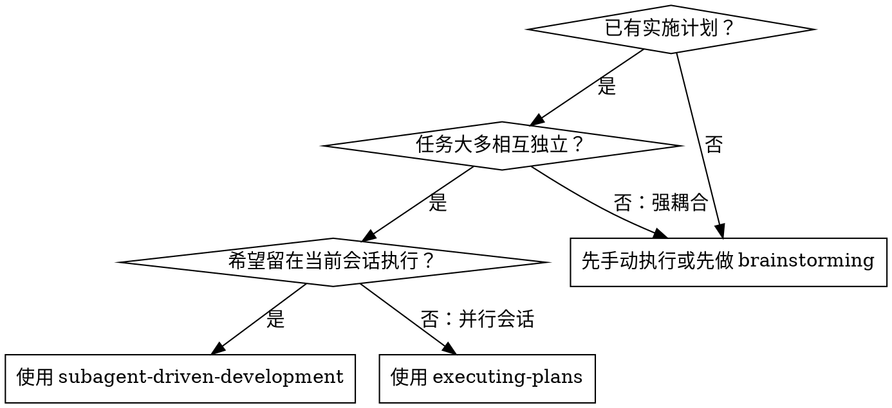
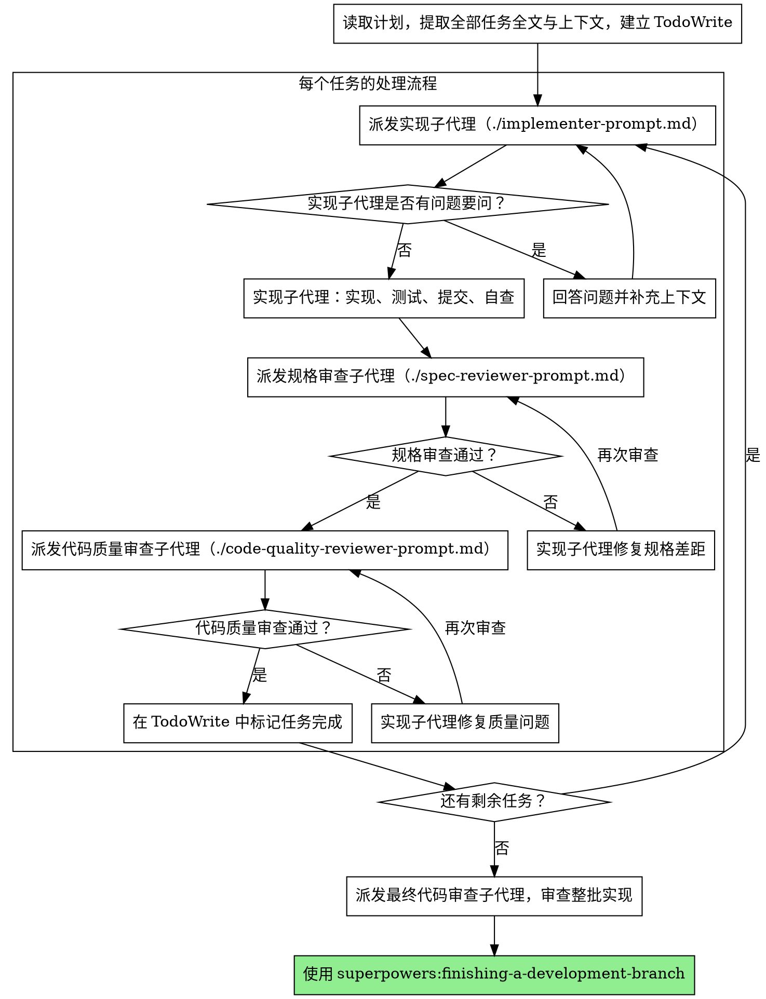

# 子代理驱动开发

通过为每个任务派发全新的子代理来执行计划，并在每个任务后进行两阶段审查：**先做规范符合性审查，再做代码质量审查。**

**核心原则：** 每个任务使用新的子代理 + 两阶段审查（先规格、后质量） = 更高质量、更快迭代。

## 何时使用



**与 `executing-plans`（并行会话）相比：**
- 在同一个会话中完成，无需切换上下文
- 每个任务都用新的子代理，避免上下文污染
- 每个任务后都有两阶段审查：先查是否符合规格，再查代码质量
- 任务之间迭代更快，不需要人工频繁来回切换

## 流程



## 提示模板

- `./implementer-prompt.md` —— 派发实现子代理
- `./spec-reviewer-prompt.md` —— 派发规格符合性审查子代理
- `./code-quality-reviewer-prompt.md` —— 派发代码质量审查子代理

## 工作流示例

```text
你：我将使用“子代理驱动开发”来执行这份计划。

[读取计划文件：docs/plans/feature-plan.md]
[提取全部 5 个任务的全文和上下文]
[创建 TodoWrite，并写入所有任务]

任务 1：安装 hook 脚本

[获取任务 1 的全文和上下文（前面已提取）]
[派发实现子代理，并提供完整任务内容 + 上下文]

实现子代理："开始前我有个问题——这个 hook 应安装到用户级还是系统级？"

你："用户级（~/.config/superpowers/hooks/）"

实现子代理："收到，开始实现。"
[稍后] 实现子代理：
  - 已实现 install-hook 命令
  - 已补充测试，5/5 通过
  - 自查发现遗漏了 --force 参数，已补上
  - 已提交

[派发规格审查子代理]
规格审查：✅ 与规格一致，所有要求都已满足，没有额外功能

[获取 git SHA，派发代码质量审查子代理]
代码审查：优点：测试覆盖良好，结构清晰。问题：无。批准。

[标记任务 1 完成]

任务 2：恢复模式
...
```

## 优点

**相对手动执行：**
- 子代理天然倾向于遵循 TDD
- 每个任务都获得全新上下文，避免历史噪音
- 并行安全，子代理之间不会互相污染
- 子代理可以在动手前先提问

**相对 `executing-plans`：**
- 仍在同一会话中，无需切换
- 连续推进，不必等待新的批处理会话
- 自动形成审查检查点

**效率提升：**
- 控制器提前整理全文上下文，减少重复读文件成本
- 子代理能拿到完整且有组织的上下文
- 问题往往在开始前就暴露，不会拖到后面返工

**质量门禁：**
- 交接前的自查能提前发现问题
- 两阶段审查：先看规格，再看质量
- 审查循环确保修复真正闭环
- 规格审查防止做多或做少
- 质量审查确保实现方式正确且可维护

**成本：**
- 子代理调用次数更多（每任务至少 1 个实现者 + 2 个审查者）
- 控制器前置准备更多（要先提取全部任务）
- 审查循环会增加迭代次数
- 但能更早发现问题，通常比后期调试便宜

## 危险信号

**绝对不要：**
- 在未获用户明确同意的情况下，直接在 `main/master` 分支开始实现
- 跳过审查（无论是规格审查还是质量审查）
- 带着未解决问题继续下一个任务
- 并行派发多个实现子代理处理同一代码区，容易冲突
- 让子代理自己去读计划文件（应该直接给它任务全文）
- 跳过场景上下文说明（子代理必须知道任务放在整体中的位置）
- 忽略子代理的问题
- 对“差不多符合规格”妥协（规格审查发现问题 = 任务未完成）
- 跳过复审循环（审查发现问题 → 实现者修复 → 再次审查）
- 用实现者的自查取代正式审查
- **在规格审查未通过前**就开始代码质量审查
- 任一审查仍有未决问题时切到下一个任务

**如果子代理提出问题：**
- 清楚、完整地回答
- 按需补充额外上下文
- 不要催着它在信息不完整时继续实现

**如果审查者发现问题：**
- 由实现者（同一子代理）负责修复
- 修复后让审查者重新审查
- 重复，直到通过
- 不要跳过复审

**如果子代理任务失败：**
- 派发带具体修复说明的新子代理去处理
- 不要手动插进去修补一半，这样会污染上下文

## 集成关系

**所需的工作流技能：**
- `superpowers:using-git-worktrees` —— 必需：开始前先建立隔离工作区
- `superpowers:writing-plans` —— 先写计划，再由本 skill 执行
- `superpowers:requesting-code-review` —— 提供代码审查模板
- `superpowers:finishing-a-development-branch` —— 所有任务完成后收尾

**子代理应使用：**
- `superpowers:test-driven-development` —— 子代理在执行单个任务时应遵循 TDD

**替代工作流：**
- `superpowers:executing-plans` —— 适用于并行会话，而不是当前会话内执行
