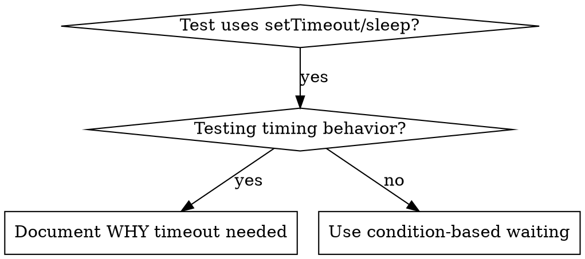

# 基于条件的等待

## 概述

不稳定的测试经常会猜测任意延迟的时间。这会产生竞争条件，测试在快速机器上通过，但在负载或 CI 中失败。

**核心原则：** 等待你关心的实际情况，而不是猜测需要多长时间。

## 何时使用



**使用时间：**
- 测试有任意延迟（`setTimeout`、`sleep`、`time.sleep()`）
- 测试不稳定（有时通过，在负载下失败）
- 并行运行时测试超时
- 等待异步操作完成

**请勿在以下情况下使用：**
- 测试实际计时行为（去抖、油门间隔）
- 如果使用任意超时，请始终记录原因

## 核心模式

```typescript
// ❌ BEFORE: Guessing at timing
await new Promise(r => setTimeout(r, 50));
const result = getResult();
expect(result).toBeDefined();

// ✅ AFTER: Waiting for condition
await waitFor(() => getResult() !== undefined);
const result = getResult();
expect(result).toBeDefined();
```

## 快速模式

|场景 |图案|
|----------|---------|
|等待活动 | `waitFor(() => events.find(e => e.type === 'DONE'))` |
|等待状态 | `waitFor(() => machine.state === 'ready')` |
|等待计数| `waitFor(() => items.length >= 5)` |
|等待文件 | `waitFor(() => fs.existsSync(path))` |
|复杂情况 | `waitFor(() => obj.ready && obj.value > 10)` |

## 实施

通用轮询功能：
```typescript
async function waitFor<T>(
  condition: () => T | undefined | null | false,
  description: string,
  timeoutMs = 5000
): Promise<T> {
  const startTime = Date.now();

  while (true) {
    const result = condition();
    if (result) return result;

    if (Date.now() - startTime > timeoutMs) {
      throw new Error(`Timeout waiting for ${description} after ${timeoutMs}ms`);
    }

    await new Promise(r => setTimeout(r, 10)); // Poll every 10ms
  }
}
```

请参阅此目录中的 `condition-based-waiting-example.ts`，以了解实际调试会话中特定于域的帮助程序（`waitForEvent`、`waitForEventCount`、`waitForEventMatch`）的完整实现。

## 常见错误

**❌ 轮询太快：** `setTimeout(check, 1)` - 浪费 CPU
**✅ 修复：** 每 10 毫秒轮询一次

**❌ 无超时：** 如果条件从未满足则永远循环
**✅ 修复：** 始终包含带有明显错误的超时

**❌ 陈旧数据：** 循环之前的缓存状态
**✅ 修复：** 在循环内调用 getter 获取新数据

## 当任意超时正确时

```typescript
// Tool ticks every 100ms - need 2 ticks to verify partial output
await waitForEvent(manager, 'TOOL_STARTED'); // First: wait for condition
await new Promise(r => setTimeout(r, 200));   // Then: wait for timed behavior
// 200ms = 2 ticks at 100ms intervals - documented and justified
```

**要求：**
1.首先等待触发条件
2.基于已知的时间（不是猜测）
3. 评论解释原因

## 现实世界的影响

来自调试会话（2025-10-03）：
- 修复了 3 个文件中的 15 个不稳定测试
- 通过率：60% → 100%
- 执行时间：快 40%
- 不再有比赛条件
