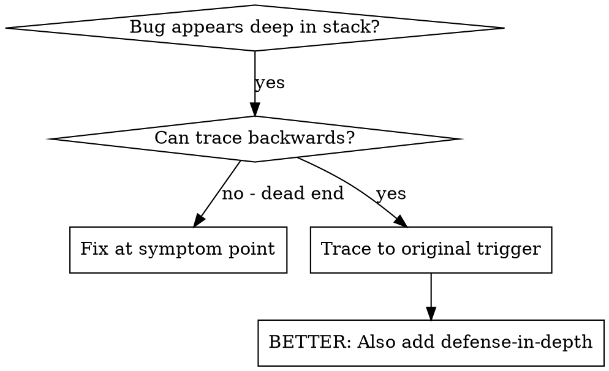
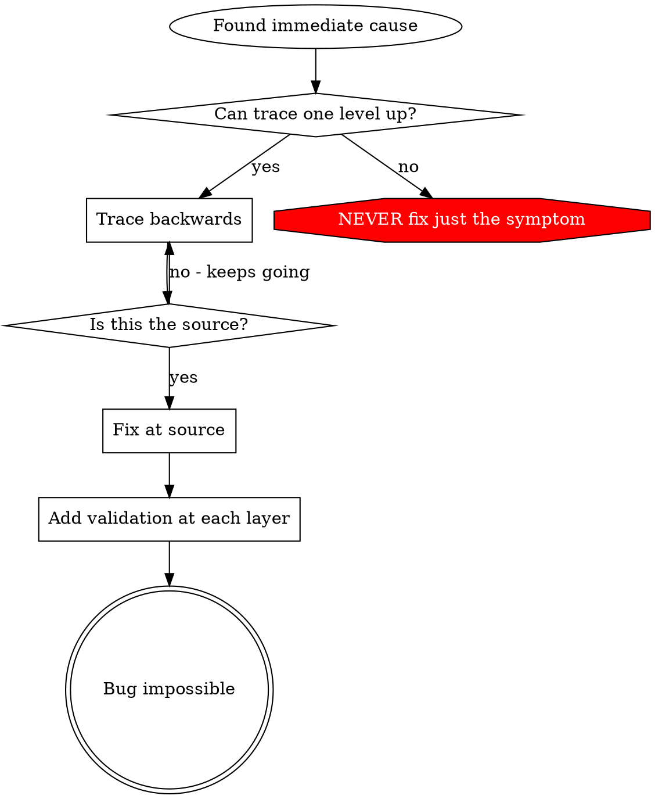

# 根本原因追踪

## 概述

错误通常表现在调用堆栈的深处（git init 在错误的目录中、在错误的位置创建文件、使用错误的路径打开数据库）。您的本能是修复错误出现的位置，但这只是治疗症状。

**核心原理：** 通过调用链向后追踪，直到找到原始触发点，然后修复源头。

## 何时使用



**使用时间：**
- 错误发生在执行深处（而不是在入口点）
- 堆栈跟踪显示长调用链
- 不清楚无效数据的来源
- 需要找到哪个测试/代码触发了问题

## 追踪过程

### 1.观察症状
```
Error: git init failed in /Users/jesse/project/packages/core
```

### 2. 找到直接原因
**什么代码直接导致这个问题？**
```typescript
await execFileAsync('git', ['init'], { cwd: projectDir });
```

### 3. 问：这叫什么？
```typescript
WorktreeManager.createSessionWorktree(projectDir, sessionId)
  → called by Session.initializeWorkspace()
  → called by Session.create()
  → called by test at Project.create()
```

### 4. 继续追踪
**传递了什么值？**
- `projectDir = ''` （空字符串！）
- 空字符串 `cwd` 解析为 `process.cwd()`
- 那是源代码目录！

### 5.找到原始触发器
**空字符串从哪里来？**
```typescript
const context = setupCoreTest(); // Returns { tempDir: '' }
Project.create('name', context.tempDir); // Accessed before beforeEach!
```

## 添加堆栈跟踪

当您无法手动跟踪时，请添加检测：

```typescript
// Before the problematic operation
async function gitInit(directory: string) {
  const stack = new Error().stack;
  console.error('DEBUG git init:', {
    directory,
    cwd: process.cwd(),
    nodeEnv: process.env.NODE_ENV,
    stack,
  });

  await execFileAsync('git', ['init'], { cwd: directory });
}
```

**关键：** 在测试中使用 `console.error()` （不是记录器 - 可能不会显示）

**运行并捕获：**
```bash
npm test 2>&1 | grep 'DEBUG git init'
```

**分析堆栈跟踪：**
- 查找测试文件名
- 查找触发呼叫的线路号码
- 识别模式（相同的测试？相同的参数？）

## 找出哪个测试造成污染

如果测试期间出现某些情况但您不知道是哪个测试：

使用此目录中的二分脚本 `find-polluter.sh` ：

```bash
./find-polluter.sh '.git' 'src/**/*.test.ts'
```

逐一运行测试，在第一个污染者处停止。使用方法请参见脚本。

## 真实示例：空projectDir

**症状：** `.git` 在 `packages/core/` 中创建（源代码）

**追踪链：**
1. `git init` 在 `process.cwd()` ← 空 cwd 参数中运行
2. 使用空的projectDir调用WorktreeManager
3. Session.create() 传递空字符串
4.测试在beforeEach之前访问`context.tempDir`
5. setupCoreTest() 最初返回 `{ tempDir: '' }`

**根本原因：** 顶级变量初始化访问空值

**修复：** 使 tempDir 成为一个 getter，如果在 beforeEach 之前访问则抛出异常

**还添加了纵深防御：**
- 第 1 层：Project.create() 验证目录
- 第 2 层：WorkspaceManager 验证不为空
- 第 3 层：NODE_ENV 防护拒绝 tmpdir 之外的 git init
- 第 4 层：git init 之前的堆栈跟踪日志记录

## 关键原理



**切勿仅修复错误出现的位置。**回溯以找到原始触发器。

## 堆栈跟踪技巧

**在测试中：** 使用 `console.error()` 而不是记录器 - 记录器可能会被抑制
**操作前：** 在危险操作之前记录，而不是在失败之后记录
**包括上下文：**目录、cwd、环境变量、时间戳
**捕获堆栈：** `new Error().stack` 显示完整的调用链

## 现实世界的影响

来自调试会话（2025-10-03）：
- 通过5级追踪找到根本原因
- 在源头修复（吸气剂验证）
- 增加了4层防御
- 通过1847项测试，零污染
